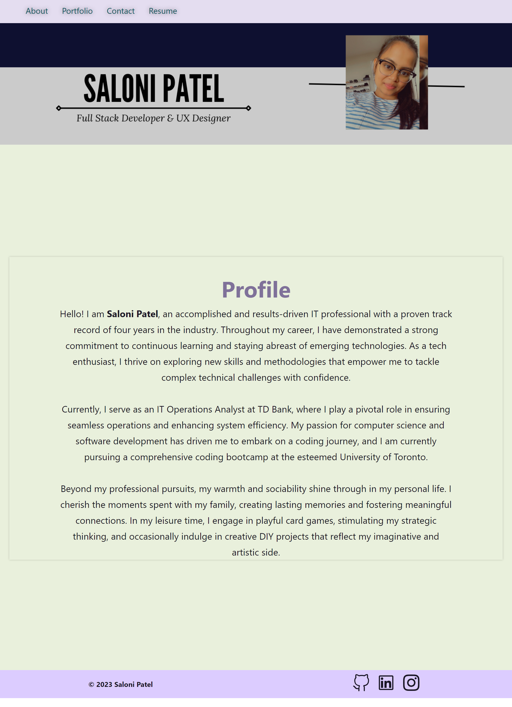

# ReactFolio-X

    

This was created to portrait my portfolio using react through which i can showcase my skills to my future employer. I created this project as it is live and offer a changing environment so i can edit it accordingly. This makes it easier for me to get all my projects on one page. This presents a header with navigation for sections like About Me, Portfolio, Contact, and Resume. Visitors can view the short bio, explore six applications with links to deployments and GitHub repositories, and find a contact form. The footer includes links to the profiles on GitHub, LinkedIn, and other platforms, providing easy connections. The design ensures a seamless experience without page reloading when clicking on navigation titles.

## Table of Contents

- [Technologies Used](#technologies-used)
- [Usage](#usage)
- [Credits](#credits)
- [Questions](#questions)

## Technologies Used

This portfolio is built using the following technologies:

- CSS
- Javascript
- React
- Express.js
- Node JS

Feel free to explore and leverage these technologies to extend and customize the functionality of JATE.

## Usage

Through 'npm run build' the dist folder will be built, bundling your assets for efficiency. The local host server will start on local host 3000. You can also run 'npm start'. To deploy to a URL on Github pages, run 'npm run deploy' every time you have updates. - <a href="https://saloni0412.github.io/ReactFolio-X/" target="_blank">Link to the app</a>

.png)
.png)
.png)

## Credits

[Badges](https://github.com/Ileriayo/markdown-badges/blob/master/README.md#badges) - Used this website to generate the badges for licenses

## Questions

If you have any questions about the repo, please contact me at ``pshashikantb@gmail.com``. You can find more of my work at [Saloni0412](https://github.com/Saloni0412/).
